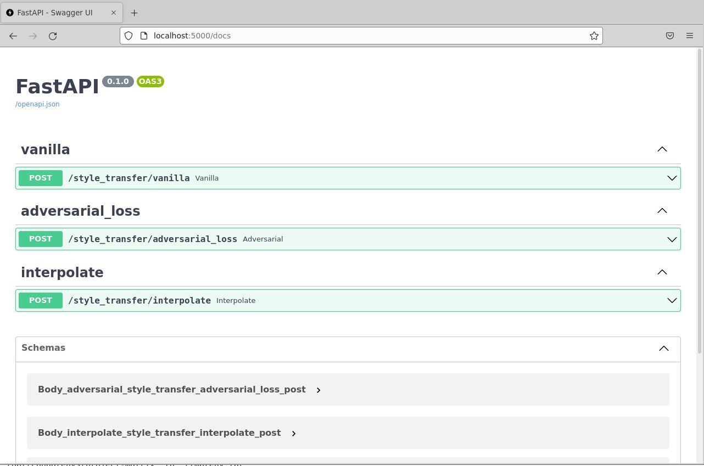
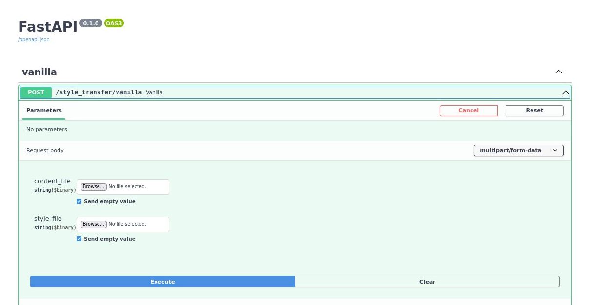
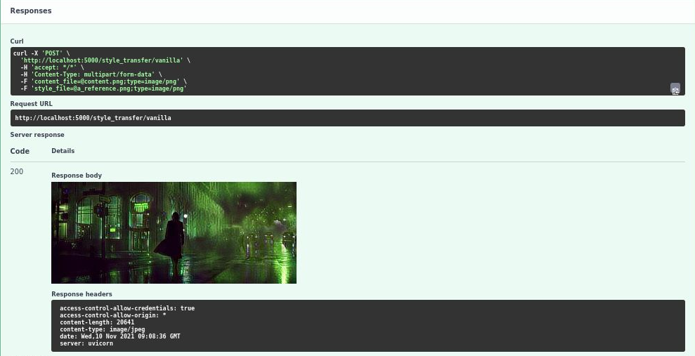
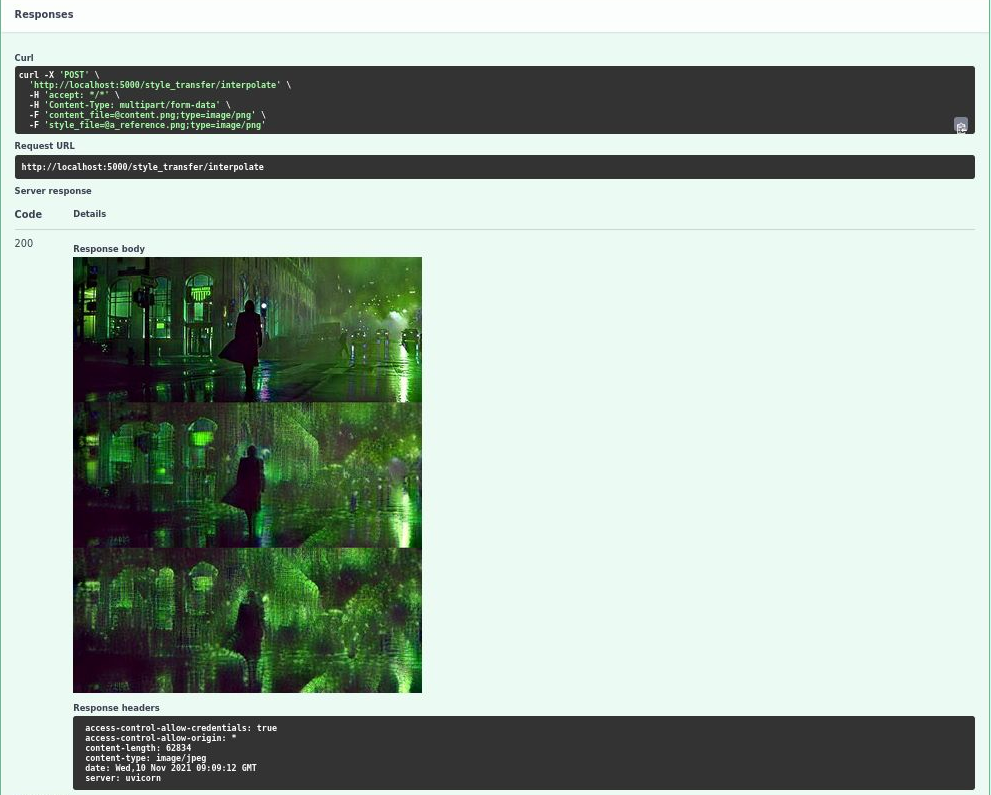
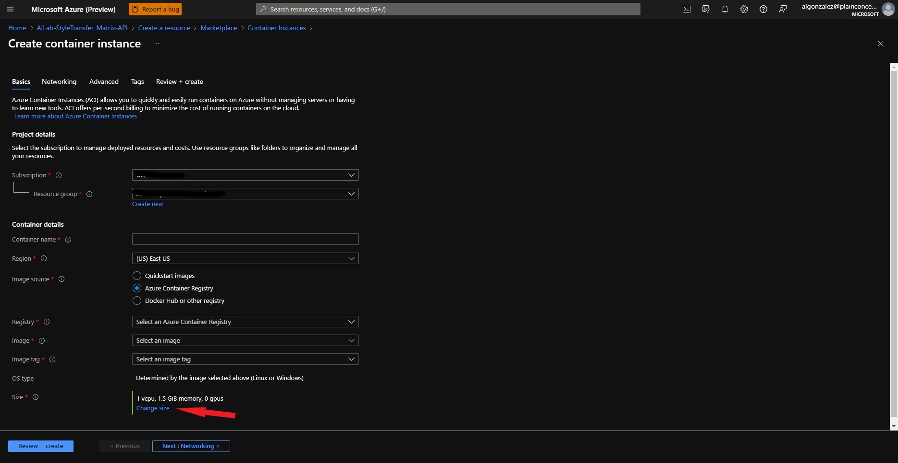
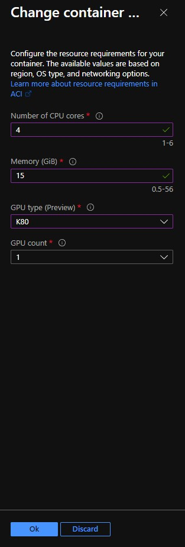
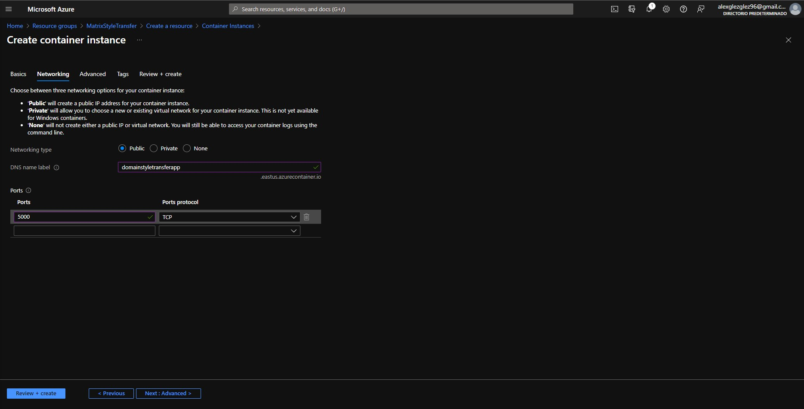

# Domain Aware Universal Style Transfer API with FastAPI

### Official Pytorch Implementation of 'Domain Aware Universal Style Transfer' (ICCV 2021)


> ## Domain Aware Universal Style Transfer
> 
> Kibeom Hong (Yonsei Univ.), Seogkyu Jeon (Yonsei Univ.), Jianlong Fu (Microsoft Research), Huan Yang (Microsoft Research), Hyeran Byun (Yonsei Univ.)
>
> Paper : https://arxiv.org/abs/2108.04441
> 
> **Abstract**: Style transfer aims to reproduce content images with the styles from reference images. Existing universal style transfer methods successfully deliver arbitrary styles to original images either in an artistic or a photo-realistic way. However, the range of “arbitrary style” defined by existing works is bounded in the particular domain due to their structural limitation. Specifically, the degrees of content preservation and stylization are established according to a predefined target domain. As a result, both photo-realistic and artistic models have difficulty in performing the desired style transfer for the other domain. To overcome this limitation, we propose a unified architecture, **D**omain-aware **S**tyle **T**ransfer **N**etworks (**DSTN**) that transfer not only the style but also the property of domain (i.e., domainness) from a given reference image. To this end, we design a novel domainness indicator that captures the domainness value from the texture and structural features of reference images. Moreover, we introduce a unified framework with domain-aware skip connection to adaptively transfer the stroke and palette to the input contents guided by the domainness indicator. Our extensive experiments validate that our model produces better qualitative results and outperforms previous methods in terms of proxy metrics on both artistic and photo-realistic stylizations.


## Prerequisites

### Download and set the pretrained weights

* Pretrained models for encoder(VGG-19) can be found in the `./baseline_checkpoints`
- Prepare pretrained models for **Domainnes Indicator**
  -  Domainnes Indicator can be downloaded at [style_indicator.pth](https://drive.google.com/file/d/1-rf2CdrCr9ei9KS-V0H3kjo1oaPmT5Xz/view?usp=sharing)
- Prepare pretrained models for **Decoder**
  -  Vanilla version can be downloaded at [Decoder.pth](https://drive.google.com/file/d/1tlUTBHB_rg9eRDa-wi1xPkbtBHGs1CUQ/view?usp=sharing)
  -  Adversarial version can be downloaded at [Decoder_adversarial.pth](https://drive.google.com/file/d/1lMCtPR-ZZUqJ1MHExXoTmCTO3K34rCCz/view?usp=sharing)

- Move these pretrained weights to each folders:
  - style_indicator.pth -> `./src/apis/models/StyleIndicator/log/`
  - decoder.pth -> `./src/apis/models/train_results/Decoder/log/`
  - decoder_adversarial.pth -> `./src/apis/models/train_results/Decoder_adversarial/log/` 
 
  **(Please rename decoder_adversarial.pth -> decoder.pth)**

### Install project dependencies

#### Run the API locally
Check the anaconda environment (`environment.yml`) for more detail. You must execute the following commands before do anything.

1. Conda commands to create local env by environment.yml. `conda env create -f environment.yml`. 
2. Then, when the environment has been created you can execute the API with the following commands: `conda activate domain-aware-style-transfer` and then `python src/app.py`. 
3. Open your favourite browser and go to `localhost:5000/docs` to see the API documentation generated by **Swagger**.

#### Run the API using Docker
1. [Go to docker install documentation](./docs/docker_install.md). 
2. When you have docker installed, go to the folder where it is the Dockerfile and write the following commands:
  - `docker build -t domain-aware-style-transfer:1 .`. 
  - When the Docker build has finished, run the next command `docker run --rm -it -p 5000:5000 domain-aware-style-transfer:1`. 
  - Finally as the above option to run locally, go and open a browser tab with this route `localhost:5000/docs`

Note: This demo has to be running on Linux system. Also, it will need a complete integration to one GPU. You could use the new Windows 11 feature to use WSL and have the complete access to your GPU without the need of full Linux system. [If it is your case see the following post](https://docs.microsoft.com/en-us/windows/ai/directml/gpu-cuda-in-wsl)

### Style Transfer API


### Example of form Data


### Inference Vanilla **decoder** and Adversarial Loss decoder 


### Inference (Interpolation)


## Optional. Deploy to Azure

### Create infrastructure
We need a infrastructure in Azure to run the API project. You will have to create the following Azure resources:

- Create a Resource Group.
- Create a Container registry (ACR) to register the Docker Image.
  - When the service has been created, the next step is to upload your local Docker Image into the register. To achieve that, follow the next commands:
    1. az login
    2. az account set -s <subscription_id>
    3. az acr login -n <your_acr_name>
    4. docker push <your_docker_image> (The Docker image will need the following format: <acr_name>.azurecr.io/<docker_image_name>:<version>)

- Create a container instance (ACI) with GPU (K80 OR P100) to deploy the Docker Image from the ACR.
  1. Create ACI 
   
  2. Select ACI specifications.
  
  

  3. Select FQDN domain name and set applications network ports 

  

  4. Click on create!

## Citation
If you find this work useful for your research, please cite:
```
@article{Hong2021DomainAwareUS,
  title={Domain-Aware Universal Style Transfer},
  author={Kibeom Hong and Seogkyu Jeon and Huan Yang and Jianlong Fu and H. Byun},
  journal={ArXiv},
  year={2021},
  volume={abs/2108.04441}
}
```
```
@InProceedings{Hong_2021_ICCV,
    author    = {Hong, Kibeom and Jeon, Seogkyu and Yang, Huan and Fu, Jianlong and Byun, Hyeran},
    title     = {Domain-Aware Universal Style Transfer},
    booktitle = {Proceedings of the IEEE/CVF International Conference on Computer Vision (ICCV)},
    month     = {October},
    year      = {2021},
    pages     = {14609-14617}
}
```

## Contact
If you have any question or comment, please contact the first author of this paper - Kibeom Hong
[cha2068@yonsei.ac.kr](cha2068@yonsei.ac.kr)
